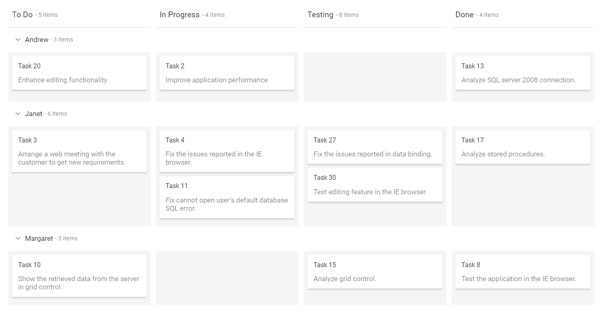
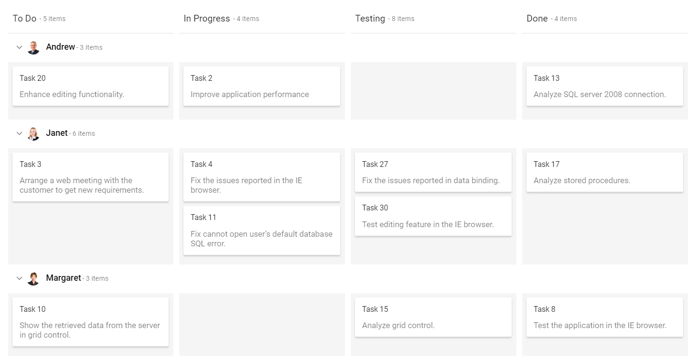
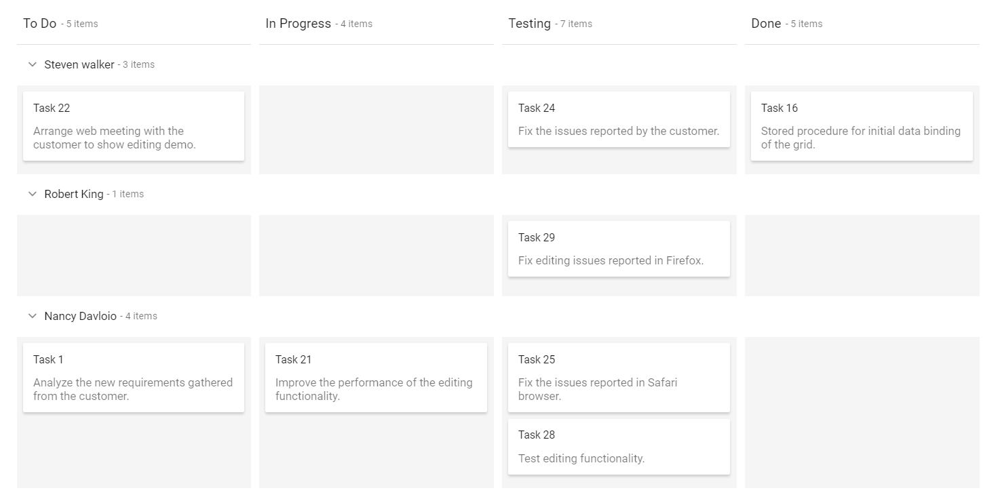
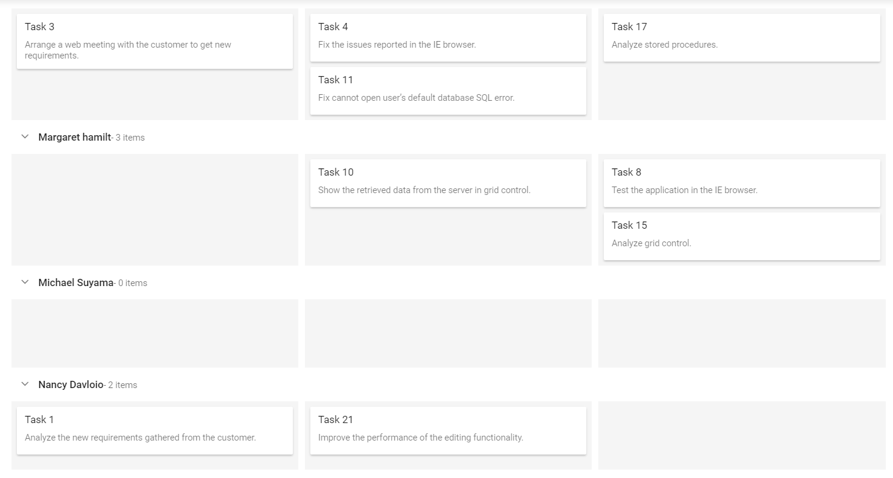
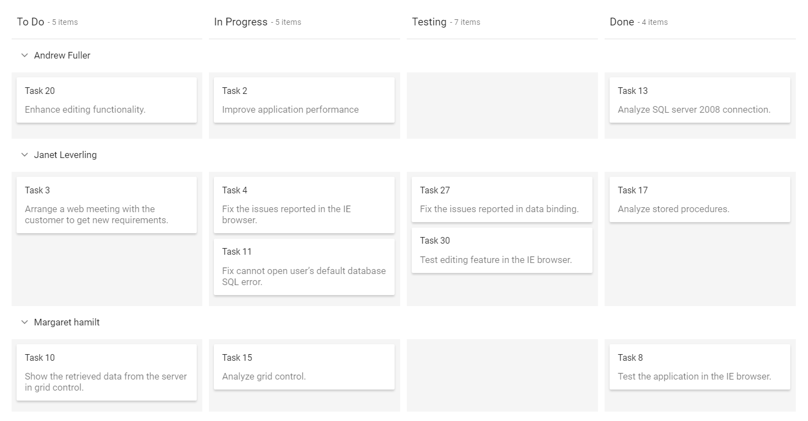

# Swimlane

Swimlanes are horizontal categorizations of cards on the Kanban board.  It is used for grouping of cards, which brings transparency to the workflow process.

## Render swimlane row

Cards can be grouped based on `keyField` and displayed in rows, which are separated by columns. It is mandatory to define the `keyField` that is mapped from the datasource for rendering swimlane rows in the Kanban board.





Output be like the below.

## Custom row text

Customize the swimlane row header text by using the `textField` property mapped from datasource.

> It is not mandatory to define the `textField` to `swimlaneSettings`.  It will automatically consider the `keyField` to swimlane row header text.
> If the mapping `textField` key is not present in the datasource, it will consider the swimlane `keyField` as swimlane row header text.





## Template

You can customize the Kanban swimlane row by using the `template` property, which is specified within the `swimlaneSettings` property. In this demo, the swimlane header is customized with HTML element.





Output be like the below.

## Sorting

Swimlane rows are rendered on descending order when using the `sortBy` property set to `Descending` order. By default, swimlane rows are rendered by **Ascending** order.





Output be like the below.

## Drag-and-drop

By default, The Kanban does not allow dragging the cards across the swimlane rows. Enabling the `dragAndDrop` property allows you to drag the cards across the swimlane rows, which is specified inside `swimlaneSettings` property.





## Create empty row

You can render the empty swimlane row by enabling the `showEmptyRow` property.  If mapping `keyField` does not have cards, empty swimlane row will be rendered.





Output be like the below.

## Calculate cards count

Users can show or hide the cards count by swimlane row in header when enabling the `showItemCount` property, which is enabled by default on the Kanban board.

> Provided localization support for **Items** text.

In below demo, disabled on `showItemCount` property on rendering swimlane row without total count.





Output be like the below.

