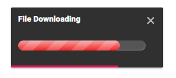

# Configuring Options

This section explains the steps required to customize the appearance of the toast using built-in APIs.

## Title and content template

Toast can be created with the notification message. The message contains [`title`](https://help.syncfusion.com/cr/aspnetcore-js2/Syncfusion.EJ2.Notifications.Toast.html#Syncfusion_EJ2_Notifications_Toast_Title) and [`content`](https://help.syncfusion.com/cr/aspnetcore-js2/Syncfusion.EJ2.Notifications.Toast.html#Syncfusion_EJ2_Notifications_Toast_Content) of the toasts. The title and contents are adaptable in any resolution.

> The Title or Content property can be given as HTML element/element ID to a string that can be displayed as a toast.





## Specifying custom target

By default, the toast can be rendered in the document body. You can change the target position for toast rendering using the [`target`](https://help.syncfusion.com/cr/aspnetcore-js2/Syncfusion.EJ2.Notifications.Toast.html#Syncfusion_EJ2_Notifications_Toast_Target) property. Based on the target, the [`position`](https://help.syncfusion.com/cr/aspnetcore-js2/Syncfusion.EJ2.Notifications.Toast.html#Syncfusion_EJ2_Notifications_Toast_Position) will be updated.

## Close button

By default, the [`showCloseButton`](https://help.syncfusion.com/cr/aspnetcore-js2/Syncfusion.EJ2.Notifications.Toast.html#Syncfusion_EJ2_Notifications_Toast_ShowCloseButton) is not enabled. You can enable it by setting the true value. Before expiring the toast, you can use this button to close or destroy toasts manually.

## Progress bar

By default, the [`showProgressBar`](https://help.syncfusion.com/cr/aspnetcore-js2/Syncfusion.EJ2.Notifications.Toast.html#Syncfusion_EJ2_Notifications_Toast_ShowProgressBar) is not enabled. If it is enabled, it can visually indicate how long to get toast expires. Based on the [`timeOut`](https://help.syncfusion.com/cr/aspnetcore-js2/Syncfusion.EJ2.Notifications.Toast.html#Syncfusion_EJ2_Notifications_Toast_TimeOut) property, progress bar will appear.

## Newest on top

By default, the newly created toasts will append next with existing toasts. You can change the sequence like inserting before the toast by enabling the [`newestOnTop`](https://help.syncfusion.com/cr/aspnetcore-js2/Syncfusion.EJ2.Notifications.Toast.html#Syncfusion_EJ2_Notifications_Toast_NewestOnTop).

Here, The following sample demonstrates the combination of the `target`, `showCloseButton`, `showProgressBar`, and `newestOnTop` properties in toast.





Output be like the below.

## Width and height

The dimensions of the toast can be set using the [`width`](https://help.syncfusion.com/cr/aspnetcore-js2/Syncfusion.EJ2.Notifications.Toast.html#Syncfusion_EJ2_Notifications_Toast_Width) and [`height`](https://help.syncfusion.com/cr/aspnetcore-js2/Syncfusion.EJ2.Notifications.Toast.html#Syncfusion_EJ2_Notifications_Toast_Height) properties. This will individually set all toasts. You can create different custom dimension toasts.

By default, the toast can be rendered with '300px' width with 'auto' height.

> In mobile devices, the default width of the toast gets '100%' width of the page.
> When you set toast width as '100%', the toast occupies full width and will be displayed at the top or bottom based on the position `Y` property.

Both the width and height properties allow setting pixels/numbers/percentage. The number value is considered as pixels.





## See Also

* [Prevent duplicate toasts](./how-to/prevent-duplicate-toast-display/)

* [Customize the progress bar](./how-to/customize-progress-bar-theme-and-sizing/)
