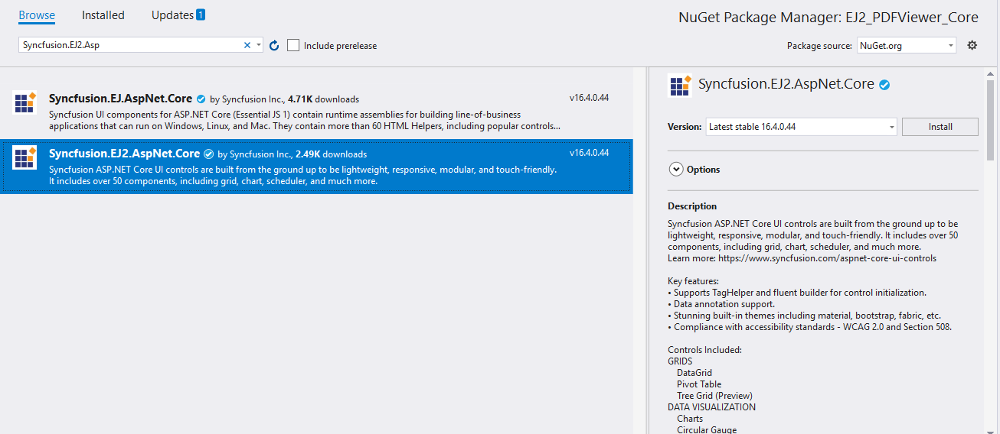
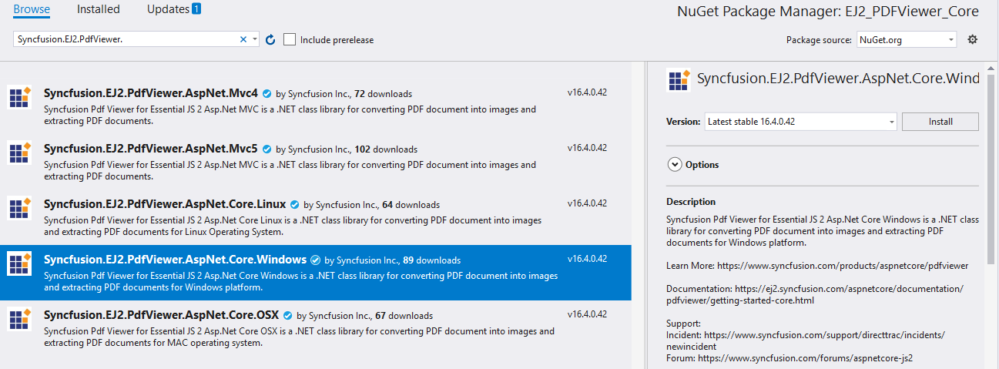

# Getting Started in ASP.NET Core PDF Viewer control

> Starting with v16.4.0.x, if you reference Syncfusion assemblies from trial setup or from the NuGet feed, include a license key in your projects. Refer to this [link](https://help.syncfusion.com/common/essential-studio/licensing/license-key) to learn about registering Syncfusion license key in your ASP.NET Core application to use Syncfusion components.

## Prerequisites

To get started with ASP.NET Core application, ensure that the following software is installed on the machine.
* .NET Core 2.0 or .NET Core 2.1 with Visual Studio 2017
(or)
* .NET Core 3.0 or .NET Core 3.1 with Visual Studio 2019

## Setup ASP.NET Core application with Essential JS 2 for ASP.NET Core

The following steps are used to create ASP.NET Core application.

**Step 1:** Create ASP.NET Core web application with default template project in Visual Studio 2017.


**Step 2:** After creating the project, add the following dependencies to your application by using `NuGet Package Manager`.
* Syncfusion.EJ2.AspNet.Core
* Syncfusion.EJ2.PdfViewer.AspNet.Core.Windows

Open the `NuGet` package manager.


Install the **Syncfusion.EJ2.AspNet.Core** package to the application.



Install the **Syncfusion.EJ2.PdfViewer.AspNet.Core.Windows** package to the application.



>For Linux and OSX operating systems use the corresponding libraries as below,
* Syncfusion.EJ2.PdfViewer.AspNet.Core.Linux
* Syncfusion.EJ2.PdfViewer.AspNet.Core.OSX

**Step 3:** Open the **Views/_ViewImports.cshtml** to import Syncfusion.EJ2 package.

```cs
@addTagHelper *, Syncfusion.EJ2
```

**Step 4:** Add client side resource through [`CDN`](http://ej2.syncfusion.com/15.4.23/documentation/base/deployment.html?lang=typescript#cdn) or local [`package`](https://www.npmjs.com/package/@syncfusion/ej2) in the layout page **Views/Shared/_Layout.cshtml.**

```html
<head>
@* Syncfusion Essential JS 2 Styles *@
<link rel="stylesheet" href="https://cdn.syncfusion.com/ej2/material.css" />

@* Syncfusion Essential JS 2 Scripts *@
<script src="https://cdn.syncfusion.com/ej2/dist/ej2.min.js"></script>
</head>
```

**Step 5:** Adding Script Manager in the layout page **Views/Shared/_Layout.cshtml.**

```cs
<body>
    @RenderBody()
    @RenderSection("Scripts", required: false)
<ejs-scripts></ejs-scripts>
</body>
```

**Step 6:** Add the following code to the Index.cshtml view page, which is presented under Views/Home folder, to initialize PDF Viewer.



