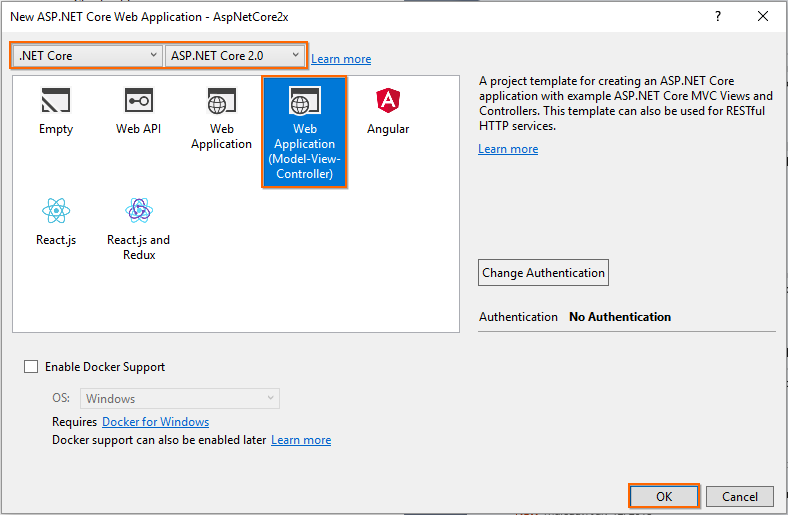
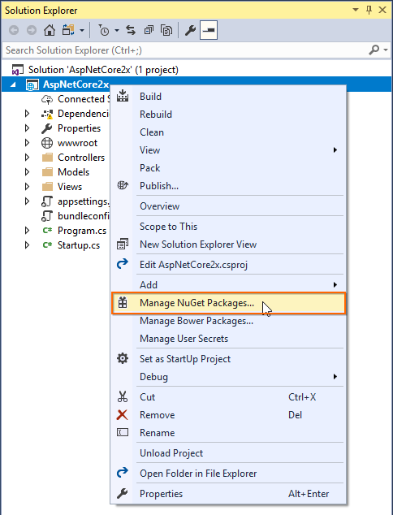
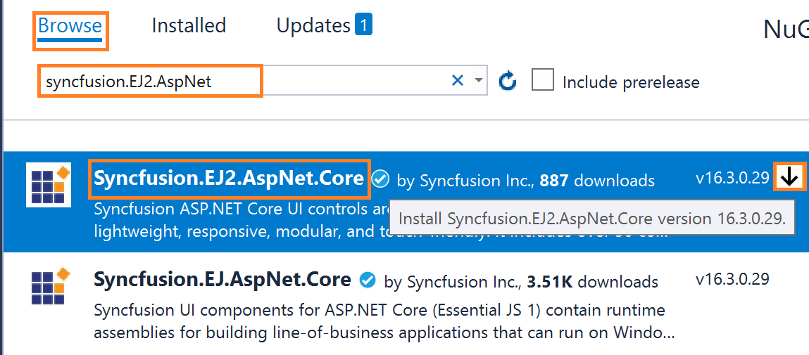

# Getting Started with ASP.NET Core

> Starting with v16.2.0.x, if you reference Syncfusion assemblies from trial setup or from the NuGet feed, you also have to include a license key in your projects. Please refer to this [link](https://help.syncfusion.com/common/essential-studio/licensing/license-key) to know about registering Syncfusion license key in your ASP.NET MVC application to use our components.

## Prerequisites

The official prerequisites to create and run an ASP.NET Core 2.x application on Windows environment are described in the [.NET Core documentation website](https://docs.microsoft.com/en-us/dotnet/core/windows-prerequisites?tabs=netcore2x).

### Create ASP.NET Core web application

**Step 1:** Choose **File > New > Project...** in the Visual Studio menu bar.


**Step 2:** Select **Installed > Visual C# > .NET Core** and choose the required **.NET Framework** in the drop-down.

**Step 3:** Select **ASP.NET Core Web Application** and change the application name, and then click **OK**.

> The Essential JS 2 supports 4.5+ .NET Framework in the ASP.NET Core application. i.e. The minimum target framework is 4.5 for Syncfusion ASP.NET Core (Essential JS 2).


**Step 4:** Choose **.NET Core** with **ASP.NET Core 2.0** and select **Web Application(Model-View-Controller)**, and then click **OK**. The web application project is now created with default ASP.NET Core template.



## Configure Essential JS 2 in the application

**Step 1:** Add the [`Syncfusion.EJ2.AspNet.Core`](https://www.nuget.org/packages/Syncfusion.EJ2.AspNet.Core/) NuGet package to the new application by using the Nuget Package Manager. Right-click the project and select **Manage NuGet Packages...**.

> Refer to [this article](../nuget-packages) to learn more details about installing Essential JS 2 NuGet packages in various OS environment.



**Step 2:** Search the `Syncfusion.EJ2.AspNet` keyword in the **Browse** tab and install **Syncfusion.EJ2.AspNet.Core** NuGet package in the application.



The Essential JS 2 package will be included in the project, after the installation process is completed.

> **Note:** The Syncfusion.EJ2.AspNet.Core NuGet package has dependencies, [`Newtonsoft.Json`](https://www.nuget.org/packages/Newtonsoft.Json/) for JSON serialization and [`Syncfusion.Licensing`](https://www.nuget.org/packages/Syncfusion.Licensing/) for validating Syncfusion license key.

**Step 3:** Open `~/Views/_ViewImports.cshtml` file and import the `Syncfusion.EJ2` package.

```html
@addTagHelper *, Syncfusion.EJ2
```

**Step 4:** Add the client-side resources through [CDN](https://ej2.syncfusion.com/documentation/deployment/#cdn) or [local npm package](https://www.npmjs.com/package/@syncfusion/ej2) in the `<head>` element of the `~/Views/Shared/_Layout.cshtml` layout page.

```html
<head>
    ....
    ....

    <!-- Syncfusion Essential JS 2 Styles -->
    <link rel="stylesheet" href="https://cdn.syncfusion.com/ej2/material.css" />

    <!-- Syncfusion Essential JS 2 Scripts -->
    <script src="https://cdn.syncfusion.com/ej2/dist/ej2.min.js"></script>
</head>
```

**Step 5:** Add the Essential JS 2 Script Manager at the end of `<body>` element in the `~/Views/Shared/_Layout.cshtml` layout page.

```html
<body>
    ....
    ....
    <!-- Syncfusion Essential JS 2 ScriptManager -->
    <ejs-scripts></ejs-scripts>
</body>
```

## Browser compatibility

Polyfills are required to use the Pivot Table in Internet Explorer 11 browser. Refer the [documentation](https://ej2.syncfusion.com/aspnetcore/documentation/browser/?no-cache=1#browser-support) for more details.

## Adding component to the application

Add the below code to your `Index.cshtml` view page which is present under `Views/Home` folder, to initialize the pivot table component with sample OLAP data source.





## Adding fields to row, column, value and filter axes

Now that pivot table is initialized and assigned with sample data, will further move to showcase the component by organizing appropriate fields in row, column, value and filter axes.

In [`e-datasourcesettings`](https://help.syncfusion.com/cr/aspnetcore-js2/Syncfusion.EJ2.PivotView.PivotViewDataSourceSettingsBuilder.html) tag, four major axes -  [`Rows`](https://help.syncfusion.com/cr/aspnetcore-js2/Syncfusion.EJ2.PivotView.PivotViewRow.html), [`Columns`](https://help.syncfusion.com/cr/aspnetcore-js2/Syncfusion.EJ2.PivotView.ColumnFieldListDataSource.html), [`Values`](https://help.syncfusion.com/cr/aspnetcore-js2/Syncfusion.EJ2.PivotView.ValueFieldListDataSource.html) and [`Filters`](https://help.syncfusion.com/cr/aspnetcore-js2/Syncfusion.EJ2.PivotView.FilterFieldListDataSource.html) plays a vital role in defining and organizing fields from the bound data source, to render the entire pivot table component in a desired format.

[`Rows`](https://help.syncfusion.com/cr/aspnetcore-js2/Syncfusion.EJ2.PivotView.PivotViewRow.html) – Collection of fields that needs to be displayed in row axis of the pivot table.

[`Columns`](https://help.syncfusion.com/cr/aspnetcore-js2/Syncfusion.EJ2.PivotView.ColumnFieldListDataSource.html) – Collection of fields that needs to be displayed in column axis of the pivot table.

[`Values`](https://help.syncfusion.com/cr/aspnetcore-js2/Syncfusion.EJ2.PivotView.ValueFieldListDataSource.html) – Collection of fields that needs to be displayed as aggregated numeric values in the pivot table.

[`Filters`](https://help.syncfusion.com/cr/aspnetcore-js2/Syncfusion.EJ2.PivotView.FilterFieldListDataSource.html) - Collection of fields that would act as master filter over the data bound in row, column and value axes of the pivot table.

In-order to define each field in the respective axis, the following basic properties should be set.

* [`name`](https://help.syncfusion.com/cr/aspnetcore-js2/Syncfusion.EJ2.PivotView.PivotViewRow.html#Syncfusion_EJ2_PivotView_PivotViewRow_Name): It allows to set the field name from the bound data source. It’s casing should match exactly like in the data source and if not set properly, the pivot table will not be rendered.
* [`caption`](https://help.syncfusion.com/cr/aspnetcore-js2/Syncfusion.EJ2.PivotView.PivotViewRow.html#Syncfusion_EJ2_PivotView_PivotViewRow_Caption): It allows to set the field caption, which is the alias name of the field that needs to be displayed in the pivot table.
* [`type`](https://help.syncfusion.com/cr/aspnetcore-js2/Syncfusion.EJ2.PivotView.PivotViewRow.html#Syncfusion_EJ2_PivotView_PivotViewRow_Type): It allows to set the summary type of the field. By default, [**Sum**](https://help.syncfusion.com/cr/aspnetcore-js2/Syncfusion.EJ2.PivotView.SummaryTypes.html) is applied.

In this illustration, "Year" and "Quarter" are added in column, "Country" and "Products" in row, and "Sold" and "Amount" in value section respectively.





## Applying formatting to a value field

Formatting defines a way in which values should be displayed. For example, format **"C"** denotes the values should be displayed in currency pattern. To do so, define the [`e-formatsettings`](https://help.syncfusion.com/cr/aspnetcore-js2/Syncfusion.EJ2.PivotView.PivotViewFormatSetting.html) tag with its [`name`](https://help.syncfusion.com/cr/aspnetcore-js2/Syncfusion.EJ2.PivotView.PivotViewFormatSetting.html#Syncfusion_EJ2_PivotView_PivotViewFormatSetting_Name) and [`format`](https://help.syncfusion.com/cr/aspnetcore-js2/Syncfusion.EJ2.PivotView.PivotViewFormatSetting.html#Syncfusion_EJ2_PivotView_PivotViewFormatSetting_Format) properties and add it to [`e-formatSettings`](https://help.syncfusion.com/cr/aspnetcore-js2/Syncfusion.EJ2.PivotView.PivotViewFormatSetting.html). In this illustration, the [`name`](https://help.syncfusion.com/cr/aspnetcore-js2/Syncfusion.EJ2.PivotView.PivotViewFormatSetting.html#Syncfusion_EJ2_PivotView_PivotViewFormatSetting_Name) property is set as **Amount**, a field from value section and its format is set as currency. Likewise, we can set format for other value fields as well and add it to [`e-formatSettings`](https://help.syncfusion.com/cr/aspnetcore-js2/Syncfusion.EJ2.PivotView.PivotViewFormatSetting.html).

> Only fields from value section, which is in the form of numeric data values are applicable for formatting.





## Enable Grouping Bar

The grouping bar feature automatically populates fields from the bound data source and allows end users to drag fields between different axes such as columns, rows, values, and filters, and alter pivot table at runtime. It also provides option to sort, filter and remove fields. It can be enabled by setting the [`showGroupingBar`](https://help.syncfusion.com/cr/aspnetcore-js2/Syncfusion.EJ2.PivotView.PivotView.html#Syncfusion_EJ2_PivotView_PivotView_ShowGroupingBar) property to **true**.





## Enable Pivot Field List

The field list allows to add or remove fields and also rearrange the fields between different axes, including column, row, value, and filter along with filter and sort options dynamically at runtime. It can be enabled by setting the [`showFieldList`](https://help.syncfusion.com/cr/aspnetcore-js2/Syncfusion.EJ2.PivotView.PivotView.html#Syncfusion_EJ2_PivotView_PivotView_ShowFieldList) property to **true**.





## Calculated field

The calculated field feature allows user to insert or add a new calculated field based on the available fields from the bound data source using basic arithmetic operators. The calculated field can be included in pivot table using the [`e-calculatedFieldSetting`](https://help.syncfusion.com/cr/aspnetcore-js2/Syncfusion.EJ2.PivotView.PivotViewCalculatedFieldSetting.html) tag from code behind. Or else, calculated fields can be added at run time through the built-in dialog by just setting the [`allowCalculatedField`](https://help.syncfusion.com/cr/aspnetcore-js2/Syncfusion.EJ2.PivotView.PivotView.html#Syncfusion_EJ2_PivotView_PivotView_AllowCalculatedField) property to **true** in pivot table. You will see a button enabled in the Field List UI automatically to invoke the calculated field dialog and perform necessary operation.

> Calculated field is applicable only for value fields.





Output be like the below.

