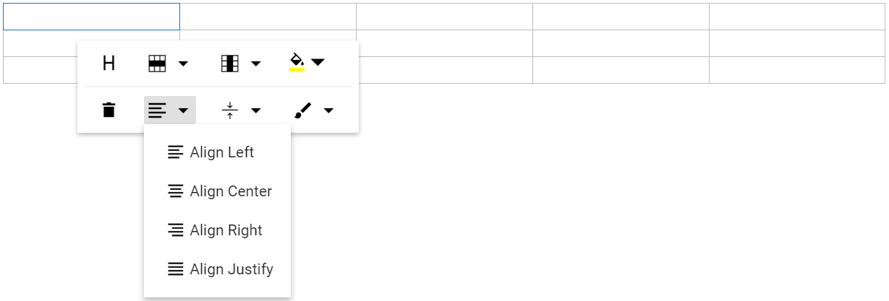
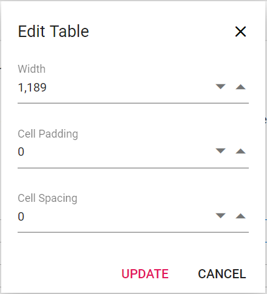

# Table

Rich Text Editor allows to insert table of content in edit panel and provide options to add, edit, and remove the table as well as perform other table related action. For inserting the table to the Rich Text Editor, the following list of options have been provided in the [`tableSettings`](https://help.syncfusion.com/cr/aspnetcore-js2/Syncfusion.EJ2.RichTextEditor.RichTextEditor.html#Syncfusion_EJ2_RichTextEditor_RichTextEditor_TableSettings)

| Options | Description | Default Value |
|----------------|---------|-----------------------------|
| minWidth | Sets the default minWidth of the table. | 0 |
| maxWidth | Sets the default maxWidth of the table. | null |
| resize | Enable resize feature in table.| true |
| styles | This is an array of key value pair, on each pair, key should be name of styling and value is class name. this list will be shown on quick toolbar options to change the styles of table on designing like dashed, double bordered. | `TableStyleItems` |
| width | Sets the default width of the table. | 100% |

## Insert Table

Using the `table` toolbar option, select a number of rows and columns to be inserted over the table grid and insert table into Rich Text Editor content using the mouse.

Tables can also be inserted through the `Insert Table` option in the pop-up where the number of rows and columns can be provided manually, and this is the default way in devices.





## Quick Toolbar

Quick toolbar is opened by clicking the table. It has different sets of commands to be performed on
the table which increases the feasibility to edit the table easily.

## Table Header

`Table Header` command is available with [`quickToolbarSettings`](https://help.syncfusion.com/cr/aspnetcore-js2/Syncfusion.EJ2.RichTextEditor.RichTextEditor.html#Syncfusion_EJ2_RichTextEditor_RichTextEditor_QuickToolbarSettings) option through which the header row can be added or removed from the inserted table. The following image illustrates the table header.

## Insert Rows

`Rows` can be inserted above or below the required table cell through the quick toolbar. Also, focused row can be deleted. The following screenshot shows the available options of the row item.

## Insert Columns

`Columns` can be inserted to the left or right side of the required table cell through the quick toolbar. Also, the focused column can be deleted. The following screenshot shows the available options of the column item.

## Set Color

The background color can be set for each table cell through the `background color` command available with quick toolbar.

## Delete Table

Using the delete item in the quick toolbar, users can delete the entire table.

## Vertical Align

Text inside the table can be aligned to top, middle, or bottom using the `tableCellVerticalAlign`
tool of the quick toolbar.

## Horizontal Align

Text inside the table can be aligned left, right, or center using the `tableCellHorizontalAlign` tool
of the quick toolbar.

## Table Styles

Table styles provided for class name should be appended to a table element. It helps to design the table in specific CSS styles when inserting in the editor.

By Default, provides Dashed border and Alternate rows.

**Dashed border**: Applies the dashed border to the table.

**Alternate border**: Applies the alternative background to the table.

## Table Properties

Sets the default width of the table when it is inserted in the Rich Text Editor using the width of
[`tableSettings`](https://help.syncfusion.com/cr/aspnetcore-js2/Syncfusion.EJ2.RichTextEditor.RichTextEditor.html#Syncfusion_EJ2_RichTextEditor_RichTextEditor_TableSettings).

Using the quick toolbar, users can change the width, cell padding, and cell spacing in the selected table using the properties option.

